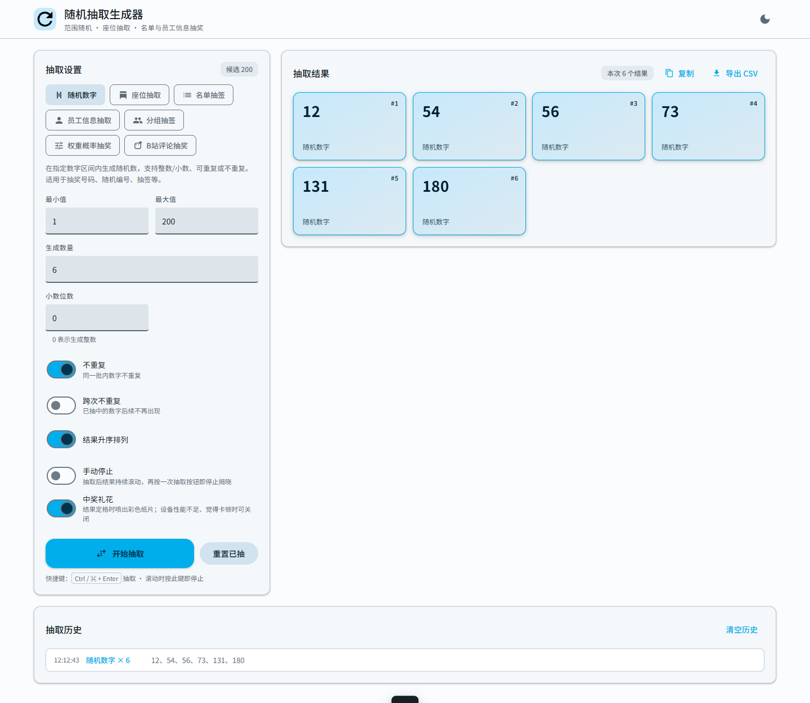
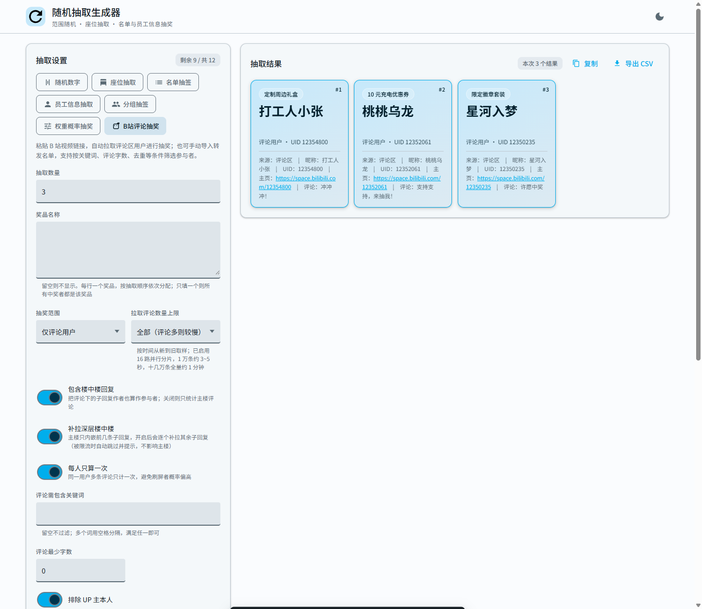
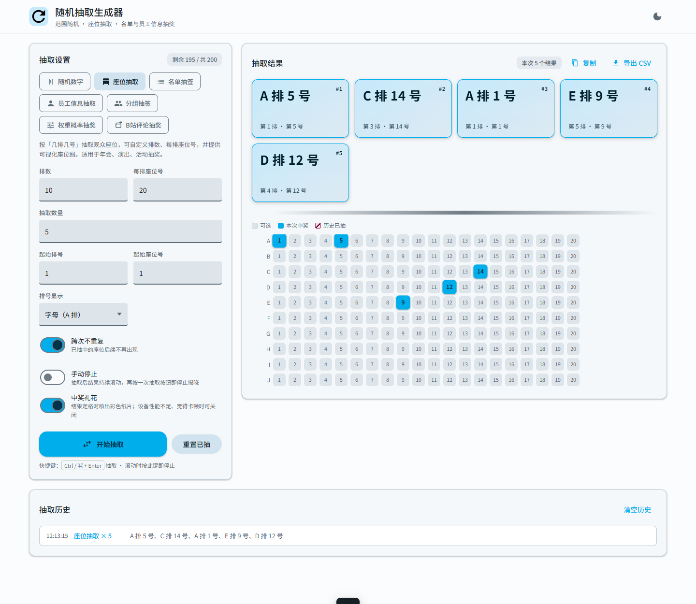
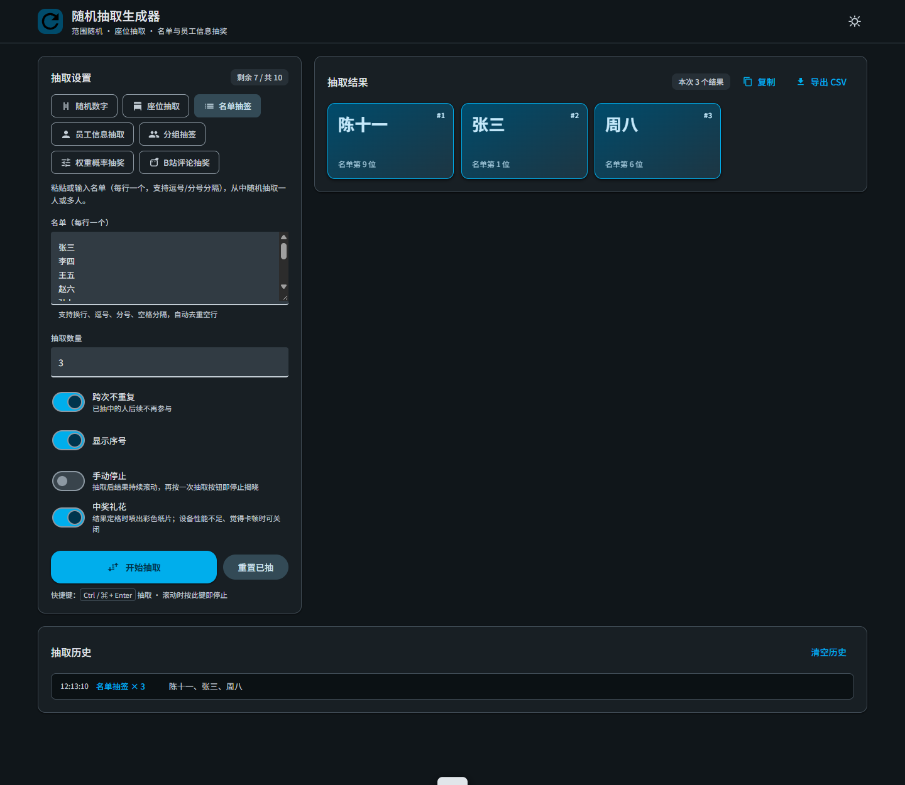

# raffle-box

**单文件、零依赖、离线可用的随机抽取 / 抽奖工具。**

双击 `index.html` 就能用 —— 不用装环境、不用起服务、不联网也能跑。
内置 7 种抽取模式，覆盖年会抽奖、团建分组、座位抽签、员工抽取、B站评论抽奖等常见场景。


---

## 界面预览

| 随机数字 | B站评论抽奖 |
|---|---|
|  |  |

| 座位抽取 | 深色主题 |
|---|---|
|  |  |

---

## 特性

- **单文件**：主程序只有 `index.html`（约 120 KB），可离线、可放 U 盘、可发邮件
- **零依赖**：不引入任何前端框架或 CDN 资源，断网照常工作
- **7 种模式**：数字、座位、名单、员工表、分组、权重、B站评论
- **Material Design 3**：哔哩哔哩标志蓝配色，支持浅色 / 深色主题
- **结果可留存**：抽取历史、一键复制、导出 CSV（带 BOM，Excel 打开不乱码）
- **隐私友好**：B站登录 Cookie 只存在助手内存中，不写盘、不经任何第三方代理

---

## 快速开始

```
双击 index.html
```

浏览器打开后，顶部切换模板，填参数，点「开始抽取」。
除「B站评论抽奖」外，其余 6 种模式**完全离线**，不需要 Node.js。

---

## 7 种模式

| 模式 | 用途 | 说明 |
|---|---|---|
| 随机数字 | 抽奖号码、随机编号 | 支持整数 / 小数（0~6 位）、不重复、跨次不重复、结果升序 |
| 座位抽取 | 年会、演出座位 | 自定义排数 / 座位号，附带可视化座位图，已中座位会标色 |
| 名单抽签 | 从名单抽人 | 每行一个，支持换行、逗号、分号分隔；可跨次不重复 |
| 员工信息抽取 | 从花名册抽人 | 导入 CSV / Excel，自动识别工号、姓名、部门、岗位，可按部门筛选 |
| 分组抽签 | 团建分队、值日排班 | 随机分 N 组，支持均分 / 不均分，不会出现空组 |
| 权重概率抽奖 | 概率可控的抽奖 | 「名称,权重」格式，权重越大越容易中；支持允许重复中奖 |
| B站评论抽奖 | 视频评论区抽奖 | 见下方说明，需配合本地助手 |

---

## B站评论抽奖

B站接口不放通 CORS，网页无法直连，因此本项目配了一个**本机助手** `bili-helper.js`。

### 用法

```bash
# 1. 启动助手（需要 Node.js 18+）
node bili-helper.js
# Windows 用户可直接双击 start-helper.bat

# 2. 网页上切到「B站评论」模板，粘贴视频链接（BV 号或完整 URL 均可）
# 3. 可选：点「扫码登录」拿到更完整的数据（不登录也能拉）
# 4. 点「拉取评论」，设置抽取人数与奖品，开始抽取
```

### 助手做了什么

- **扫码登录**：B站官方二维码登录，Cookie 仅存于内存
- **16 路并行分片**：1 万条约 3~5 秒，十几万条全量约 1 分钟，带 SSE 实时进度
- **条数上限**：全部 / 5 万 / 2 万 / 1 万 / 5 千 / 1 千，按需取样
- **楼中楼补拉**：把子回复作者也算作参与者，被限流时自动熔断并提示，不影响主楼
- **每人只算一次**：避免刷屏者概率偏高；可排除 UP 主本人

### 可调参数（环境变量）

| 变量 | 说明 | 默认 |
|---|---|---|
| `BILI_MAIN_CONC` | 主楼分片并发数 | 16 |
| `BILI_CONC` | 楼中楼补拉并发数 | 8 |
| `BILI_RATE` | 总请求速率上限（次/秒） | 150 |
| `BILI_BLOCKS` | 分片数上限 | 600 |
| `BILI_HELPER_PORT` | 助手监听端口 | 8787 |
| `BILI_DEBUG` | 设为 1 打印游标推进，便于排查 | 关闭 |

### 没有 Node.js 也没关系

- 仓库 Releases 里附带了 Node.js 24 LTS 的官方离线安装包
- 装不了环境时，可用网页内置的「视频页控制台脚本」兜底：
  展开「网络设置与手动导入」→ 复制脚本 → 在视频页 F12 控制台运行 → 把输出的 JSON 粘回「解析粘贴内容」

---

## 目录结构

```
raffle-box/
├── index.html          主程序（单文件，离线可用）
├── bili-helper.js      本地助手：B站评论抓取 + 扫码登录（零外部依赖）
├── start-helper.bat    Windows 一键启动助手
├── qrlib/              扫码登录用的二维码生成库（内嵌 qrcode，MIT）
├── runtime/            Node.js 离线安装包（体积较大，见 Releases）
├── docs/               README 截图
├── 员工信息模板.csv     员工表导入示例
└── 使用说明.txt         中文上手说明
```

---

## 隐私与安全

- 助手**只监听 127.0.0.1**，不对外暴露端口
- 登录 Cookie **只存在进程内存**，不写盘、不打印日志，进程退出即失效
- 请求**直连 B站官方接口**，不经任何第三方代理转发
- 视频页控制台脚本同样在浏览器同源执行，不上传任何凭据
- 本项目不收集、不上传任何使用数据

> 若你把 `员工信息模板.csv` 换成真实花名册，建议先用 `.gitignore` 排除，不要传公开仓库。

---

## 第三方组件

- [qrcode](https://github.com/soldair/node-qrcode) v1.5.4（MIT）—— 内嵌于 `qrlib/`，用于生成登录二维码，许可见 `qrlib/LICENSE-qrcode.txt`
- [Node.js](https://nodejs.org/)（MIT）—— 运行本地助手所需，`runtime/` 下的安装包来自官方发布页

---

## 许可

[MIT](LICENSE) © 2026 raffle-box contributors
